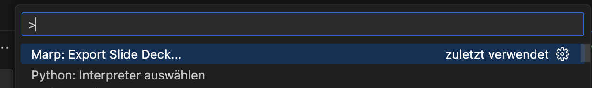

# **Präsentation**

Es ist soo enifach eine Präsentation zu machen...

---

# Wie man die einzelnen Slides machte

Die seiten werden mit (`---`) getrennt. Sooo einfach! :satisfied:

```markdown
# Slide 1

foobar

---

# Slide 2

foobar
```

---

# Erzeugen als PDF
##  Beispiel: VSCode

1. Extension installieren
    - 
1. PDF generieren
    - 

