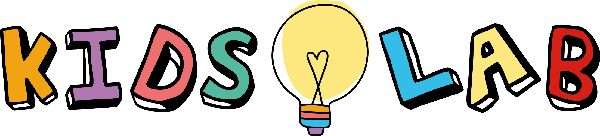

# Eigene Minecraft-Mod erstellen: Alpaka-Ball!

Minecraft ist nicht nur ein außergewöhnlich kreatives Computerspiel – es ist auch eines der erfolgreichsten Computerspiele der Welt und bei Groß und Klein gleichermaßen beliebt. Diese Begeisterung kann man nutzen, um Neues zu lernen: Erstelle deine eigene Mod, also eine Erweiterung für Minecraft, und damit dein "Spiel im Spiel": Alpakaball!

Die Open-Source Entwicklungsumgebung MCreator (https://mcreator.net/) bietet dazu alles Nötige: ein einfacher Start, die Mögichkeit zum Pixeln der Blöcke und eine einfache Programmierung. Die ganze Mod kann man in 8 einzelnen Workshops (1-2h) oder als Tages-Workshops erstellen. 

**Lizenz** CC BY 4.0 KidsLab  
**Zielgruppe** ab 10  
**Kategorie** Coding, Gaming, Design  

## Einführung
"MCreator ist eine Open-Source-Software, mit der Minecraft Java Edition Mods, Bedrock Edition Add-Ons und Data Packs über eine intuitive, leicht zu erlernende Oberfläche oder mit einem integrierten Code-Editor erstellt werden können. Sie wird weltweit von Minecraft-Spielern, Mod-Entwicklern, in der Ausbildung und in MINT-Workshops eingesetzt." (Quelle: https://mcreator.net/)

In diesem Video lernst du die Basics - in 30 Minuten ist MCreator installiert und die erste eigene Mod fertig: https://youtu.be/QeViHXM0aFQ

## Was brauche ich dafür?
|||
-|-
**Software:**       | [MCreator](https://mcreator.net/download)
**Geräte:**         | Computer pro Teilnehmer\*in & Mentor\*in, Beamer
**Internet:**       | MCreator braucht Internet  
**Kein Account:**   | MCreator Mods können auch ***ohne*** Minecraft Account getestet / gespielt werden 
**Personenzahl:**   | 10 Teilnehmer\*innen + 2 Mentor\*innen

## Vorbereitung 
- MCreator auf allen Computern installieren (https://mcreator.net/install)
- Nach dem Installieren an jedem Computer ein neues MCreator Projekt erstellen. Beim ersten Mal werden weitere Dateien für MCreator heruntergeladen. Der initiale Download aller Bibliotheken dauert sonst weiterey 15-30 Minuten im Workshop.

## Online-Version mit Links zu weiteren zugehörigen Dokumenten

Du findest diese Anleitung - zusammen mit allen Texturen und sonstigen Inhalten auch online: https://handbuch.kidslab.de/mcreator-alapaka-ball-minecraft-mod/ 

## Source-Code und weitere Dateien

Alle Quell-Dateien und auch die fertige Mod aus diesem OER findest du auf GitHub: https://github.com/KidsLabDe/alpaka_ball_oer

